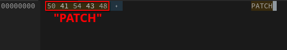

# mddr-ipspatchgen
An IPS patch generator for MDDR. 
## Structure
The structure of a MDDR IPS patch is pretty easy to understand.
### Header
The header starts with the word "PATCH". 
 
Then, the Patch Name follows the word, and ends with 0x00 as an EOF. 
 